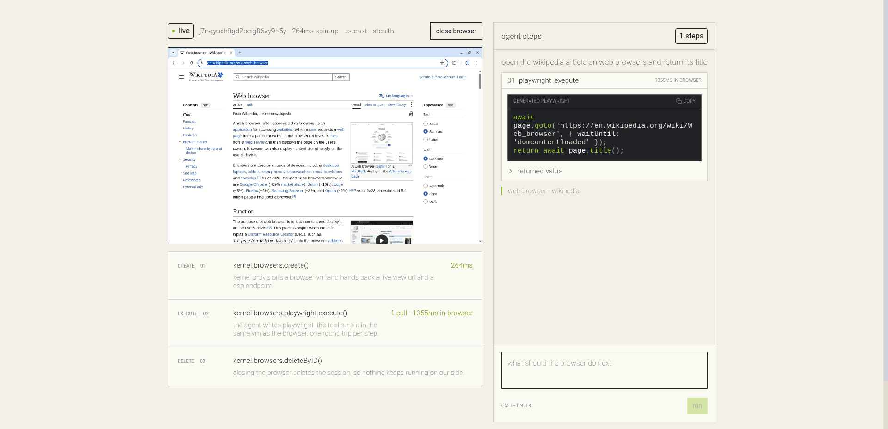

# KERNEL next.js template



one page that creates a KERNEL cloud browser, lets a gpt-5.4 agent write and run playwright against it, and keeps the browser and the generated code side by side.

<!-- this url must match DEPLOY_URL in lib/deploy-url.ts -->
[](https://vercel.com/new/clone?repository-url=https%3A%2F%2Fgithub.com%2Fkernel%2Fkernel-nextjs-template&env=OPENAI_API_KEY&project-name=kernel-nextjs-template&repository-name=kernel-nextjs-template&products=%5B%7B%22type%22%3A%22integration%22%2C%22integrationSlug%22%3A%22kernel%22%2C%22productSlug%22%3A%22kernel%22%2C%22protocol%22%3A%22other%22%7D%5D)

## what this shows

- creating a browser session with the KERNEL sdk, and streaming the live view into the page
- an AI SDK agent (`ToolLoopAgent` on gpt-5.4) whose only tool is playwright execution
- the agent writing playwright, running it in the browser vm, and returning a value to the model
- every step streamed into a sidebar with the code, the execution time, the return value, and failures

## quick start

```bash
bun install
cp .env.example .env.local   # add KERNEL_API_KEY and OPENAI_API_KEY
bun dev
```

open http://localhost:3000, create a browser, and describe a task.

## the three calls

the whole browser layer is three methods on the KERNEL client. the template calls them from route handlers.

```ts
// app/api/create-browser/route.ts
const browser = await kernel.browsers.create({ stealth: true, headless: false });
browser.browser_live_view_url; // stream this into an iframe
browser.cdp_ws_url; // or attach your own playwright client
browser.session_id;

// lib/playwright-tool.ts — what the model calls, one call per step
await kernel.browsers.playwright.execute(sessionId, { code, timeout_sec });

// app/api/delete-browser/route.ts
await kernel.browsers.deleteByID(sessionId);
```

`playwright.execute` runs the code in the same vm as the browser, with `page`, `context`, `browser`, and `webmcp` in scope, and returns whatever the code returns. that return value is what the model sees, so `return` the data the task asks for.

## code map

```
app/
├── api/
│   ├── agent/route.ts          # ToolLoopAgent + streaming ui message response
│   ├── create-browser/route.ts # browser session, live view url, spin-up time
│   └── delete-browser/route.ts # closes the session
├── page.tsx                    # hero, split view, footer
├── layout.tsx                  # fonts and metadata
└── globals.css                 # KERNEL design tokens
components/
├── AgentStepsSidebar.tsx       # streamed steps, task composer
├── BrowserPanel.tsx            # live view, session details
├── HowItWorks.tsx              # the three calls with this session's numbers
├── Header.tsx
├── ai-elements/                # code block and stack trace, styled to the design system
└── ui/                         # shadcn/ui primitives
lib/
├── constants.ts                # shared agent step-count limit
├── deploy-url.ts                # deploy-with-vercel clone url
├── playwright-tool.ts          # the playwright_execute tool
├── shiki.ts                    # syntax highlighting
└── types.ts                    # shared types
```

## how the streaming works

`/api/agent` builds a `ToolLoopAgent` and returns `toUIMessageStreamResponse()`, so tool calls and results reach the browser as they happen. the sidebar renders the `tool-playwright_execute` parts from `useChat`, which is where the per-step status, code, and return value come from. you see the run while it runs.

## environment

| variable | where it comes from |
| --- | --- |
| `KERNEL_API_KEY` | [dashboard.onkernel.com](https://dashboard.onkernel.com), or the KERNEL integration in the vercel marketplace |
| `OPENAI_API_KEY` | [platform.openai.com](https://platform.openai.com/api-keys) |

## deploy

push to github and import the repo at [vercel.com/new](https://vercel.com/new), or use the deploy button above. install the [KERNEL integration](https://vercel.com/integrations/kernel) to have `KERNEL_API_KEY` set for you, then add `OPENAI_API_KEY` yourself.

> [!WARNING]
> `/api/agent` accepts any `sessionId` and runs whatever playwright the model writes against it, with no auth or rate limiting. a public deploy runs on your keys for anyone who finds the url - add access control before sharing a deployed link.

## links

- [KERNEL docs](https://kernel.sh/docs)
- [playwright execution](https://kernel.sh/docs/browsers/playwright-execution)
- [vercel ai sdk](https://ai-sdk.dev)
